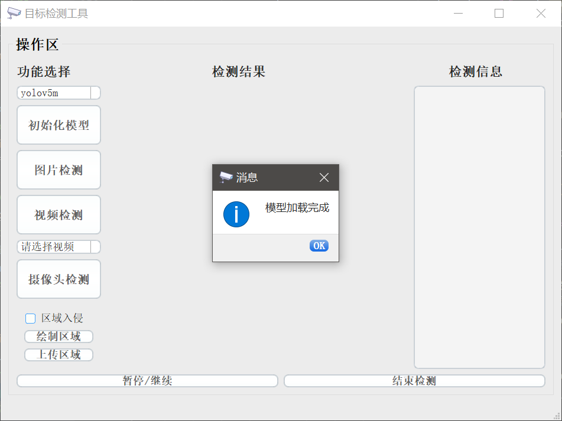
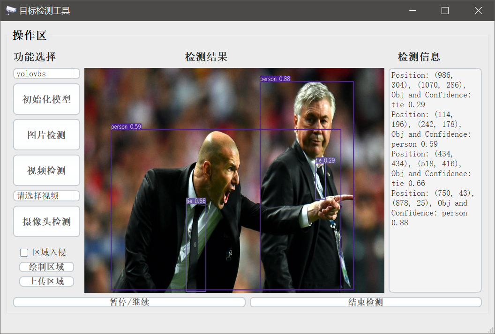
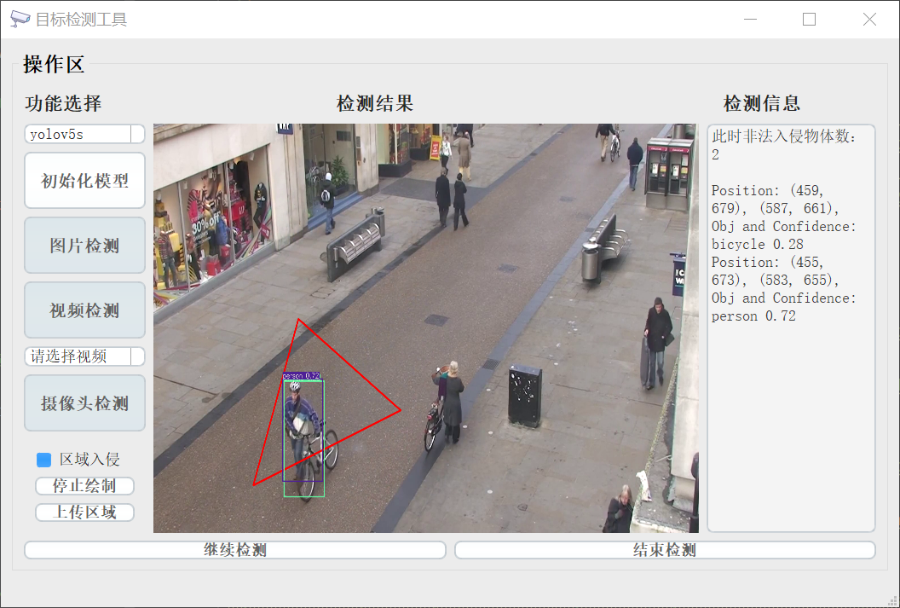

# 基于yolov5的实时区域入侵检测方法与系统


[英文文档](./README_EN.md)

**更新2023.04.28**

添加鼠标绘制多边形功能：

- 现支持鼠标绘制和直接读取json类型的多边形坐标信息
---
## 一、项目简介
使用PyQt5为yolov5添加一个可视化检测界面，并实现简单的界面跳转，以及区域入侵，具体情况如下：

**特点：**
 1. UI界面与逻辑代码分离
 2. 支持自选定模型
 3. 同时输出检测结果与相应相关信息
 4. 支持图片，视频，摄像头检测
 5. 支持视频暂停与继续检测
 6. 支持区域入侵、自定义区域、计数
## 二、快速开始
**环境与相关文件配置：**
 - 按照`ult-yolov5`中的`requirements`要求配置环境
 - 安装 PyQt5，并注意需要在一个`env`环境中进行安装与配置
 - 下载或训练一个模型，将`.pt`文件放到`weights`文件夹，权重文件可以自己选，程序默认打开`weights`文件夹
    - 使用的 YOLOv5 release 版本为 v5.0: [Releases · ultralytics/yolov5 (github.com)](https://github.com/ultralytics/yolov5/releases)
 - 设置`init`中的`opt`参数，`opt`参数的设置与`detect.py`中的设置一致
 - 需要在 PyCharm 配置外部工具 Qtdesigner 和 PYUIC

**程序使用方式：**

 - 直接运行`detect_logicwd.py`，进入检测界面
   ```shell script
   python detect_logicwd.py
   ```
## 三、使用说明

1. 启动`detect_logicwd.py`后，显示具体的软件界面

   

   系统界面分为左侧的功能选择、右侧的目标检测物体信息以及中间的检测结果画面。

2. 首先在 **功能选择** 区选择可用的yolov5权重文件，然后点击 **初始化模型** 按钮完成目标检测模型的载入。权重模型的选择支持自己训练的模型，只要放置到对应的weights文件夹下，通过PyQT添加对应的comboBox文本即可

   

3. 后续可以选择 **图片检测** 或者 **视频检测**，通过上传本地图片或者本地视频进行目标检测。通过 **结束检测** 按钮来终止当前的目标检测

   1. 图片检测效果
   

   2. 视频检测效果


4. 在 **视频检测** 中，支持绘制多边形区域。当有物体进入到多边形区域内，会检测到该物体的类别（物体进入的判断依据：目标检测识别出的检测框的中心位置，与多边形的相对位置关系）。

   1. 绘制操作：勾选 **“区域入侵”** 后，点击 **绘制区域**， 在 **检测结果** 区域内，**单击鼠标左键**，创建多边形的点坐标，当创建的点个数大于等于2时，会自动开启 **区域入侵检测** 算法，只检测当前进入了绘制的区域多边形的物体，输出相关检测信息，其余不在区域外、识别到的物体不进行信息输出。
   

   2. 上传json格式的坐标文件：事先准备好文件，内容组织形式如下，(xn, yn)代表多边形的一个点的坐标信息，坐标系以软件界面的 **检测结果** 左上角区域为原点。
   

      勾选 **“区域入侵”**，选择上传的json文件后，即可开启区域入侵检测算法
      

   3. 除了本地视频外，同样支持视频流的检测，只需要提供对应的视频流信息即可，同样支持鼠标绘制和上传区域两种方式开展区域入侵检测，受限于本机电脑性能，不做演示。
## 四、项目结构
```
.
├── models/                    # yolov5 的配置文件
├── output/                    # yolov5 对图片的目标检测结果
├── ruqin/                     # 绘制多边形区域的 JSON 文件
├── ui/                        # PyQT5 生成的 UI 文件和 PY 文件，当前使用的界面文件是 detect_ui_new_v2.py
├── weights/                   # 存放 yolov5 以及其他训练模型的权重文件
├── line_draw.py               # 包含区域入侵的检测算法，控制显示检测区域的入侵物体、绘制多边形区域等等
└── detect_logicwd.py          # 软件主体，也是项目运行的入口。内容包括引入 UI 对应的 PY 文件、各个按钮的逻辑实现、输出信息实现（检测框、物体信息、坐标、置信度、视频画面等等）
```
## 五、参考
 - Github项目：https://github.com/BonesCat/yolov5_PyQt5
---
如果本项目对你有帮助，欢迎点个star，谢谢！